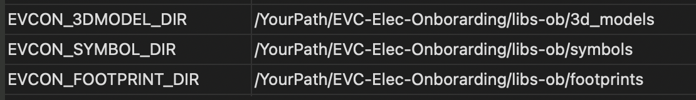
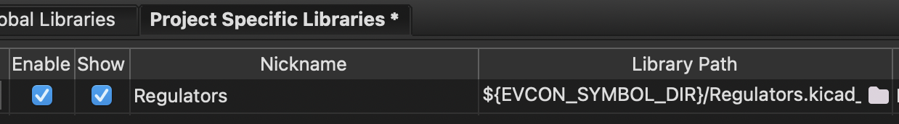

# EVC-Elec-Onborarding

Hello onboarding members!

We're going to use this repo as a way for you guys to get practice using Github and EV Concepts workflow. This repo is going to be organized the same way that our main repo (EVC-PCB) is. 

First, let us look at what you need before you start. You need to download at least KiCAD 10 and Git. I also recommened getting Github Desktop

https://www.kicad.org/download/\
https://git-scm.com/install/\
https://desktop.github.com/download/

Also take a look at the documentation for our main repo. We will follow the exact same structure, but change a few variables in order for it to function with this repo. 

https://github.com/ill-ev-concept/EVC-PCB/blob/main/README.md

Let's look at the section where we set paths in KiCAD. We use ```EVC_SYMBOL_DIR```, ```EVC_FOOTPRINT_DIR```, and ```EVC_3DMODEL_DIR``` as variables to set paths for our main repo. In this repo, we will be using different paths. Create three varibles called ```EVCOB_SYMBOL_DIR```, ```EVCOB_FOOTPRINT_DIR```, and ```EVCOB_3DMODEL_DIR```. Link these to the location of the ```symbols```, ```footprints```, and ```3d_models``` folders contained with ```libs-ob``` folder.

It should look like below:



Similarly, we will be needing KiCAD to look at the given library. We can do this by going to "Preferences" and finding either "Manage Symbol Libraries" or "Manage Footprint Libraries". Opening either brings up a window where we can select "Project Specific Libraries" where we can add paths. Click the folder icon and add the wanted library. If you set the path up correctly, the library path will contain  ```${EVCON_SYMBOL_DIR}```, ```${EVCON_FOOTPRINT_DIR}```, or ```${EVCON_3DMODEL_DIR}```. 

It will look like below if done correctly.



Now that your paths are set up properly, its important to use Git and Github properly. Read the Contributing section of EVC-PCB's README file. It goes into detail of how to contribute and properly pull, merge, and create PRs.

Make sure to push and pull from this specific repo, EVC-Elec-Onboarding, not EVC-PCB. EVC-PCB will be the repo you work in after onboarding. Right now, we want to see your work in this repo.

If you have any questions, feel free to message either Miles (mileskubik), Himesh (hotmesh), or Ethan (whybd) on Discord or find us after a meeting. 

Good luck designing!


